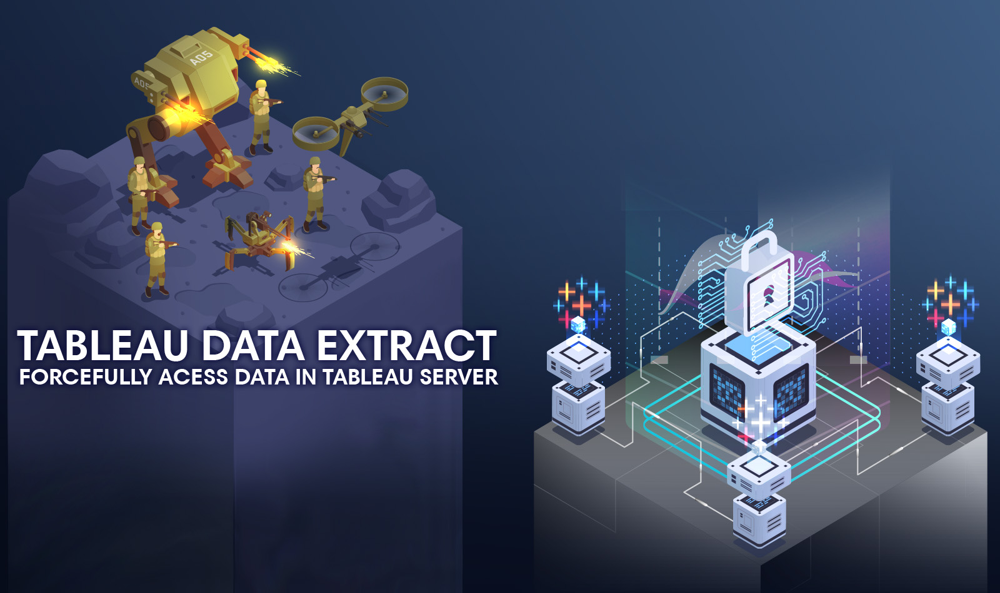

# Tableau View Extractor

Application that provides an interface for extracting data from a Tableau Server instance. This project is part of a series of exercises that attempt to make data on self-hosted Tableau instances more available. Find the accompanying blog post [here](https://hackersandslackers.com/hostile-extraction-of-tableau-server-data/).

## Status

This project is currently working as a POC and under active development. Upon completion, this application will be hosted on Google App Engine and allow for any Tableau server owner to build data pipelines using nothing but Tableau. If you're interested in seeing this project reach completion, please consider starring this project or express interest to let us gauge priority.

### In Development

The following features are currently in development:

* Tableau Server login
* Visual interface to specify external target database
* Scheduling
* Security hardening
* UI revamp
